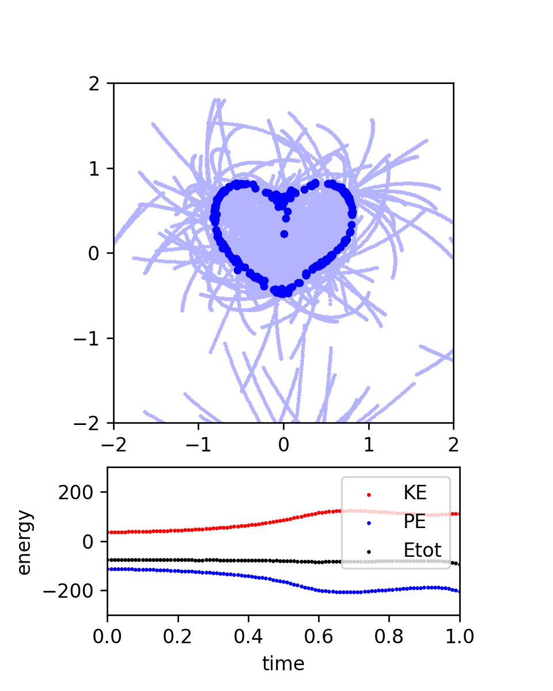
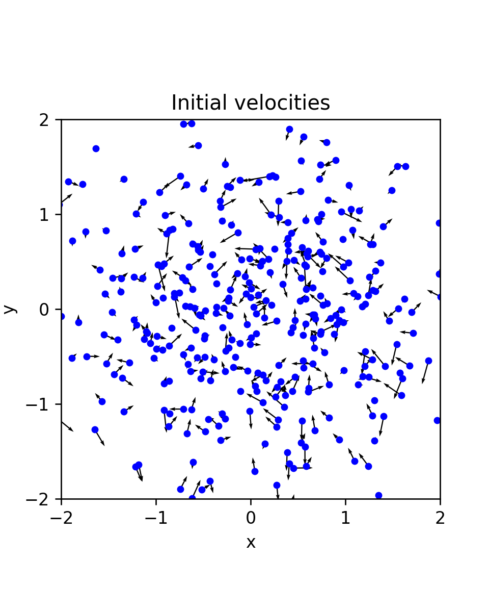

# nbody-jax
Differentiable N-body code (JAX)

## Create Your Own Differentiable N-body Simulation (With Python/JAX)

### Philip Mocz (2025)

### [📝 Read the Algorithm Write-up on Medium](https://medium.com/swlh/XXX)

Simulate orbits of stars interacting due to gravity

Code calculates pairwise forces according to Newton's Law of Gravity

Solve an Inverse Problem (with automatic differentiation!):
Given a distribution of masses, find initial velocities
that evolve the distribution into a heart-shaped configuration.

```
python nbody.py
```



The inititial condition that led to the heart-shape:


